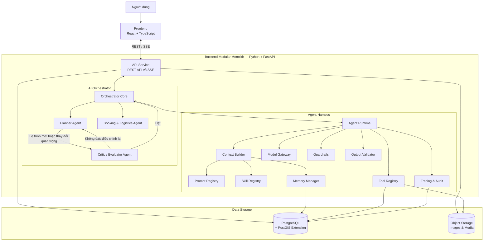
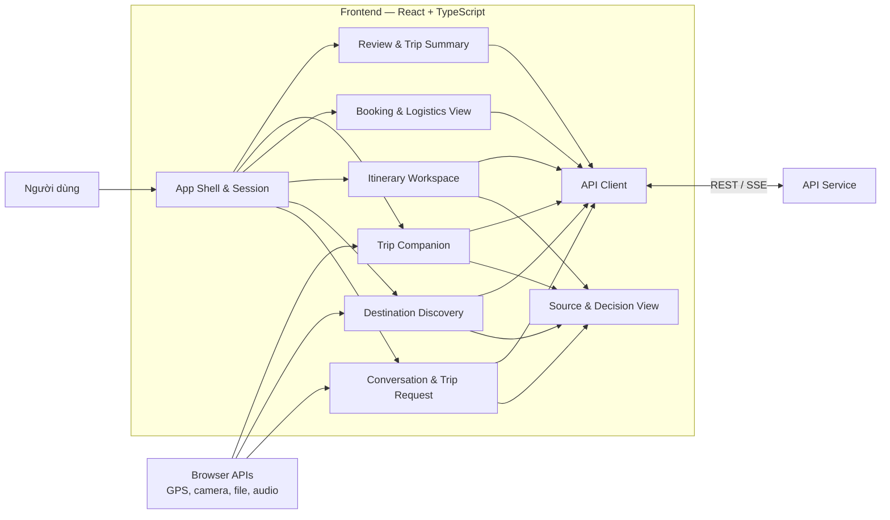
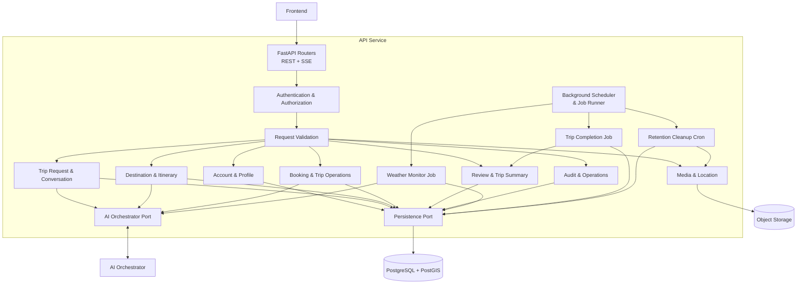
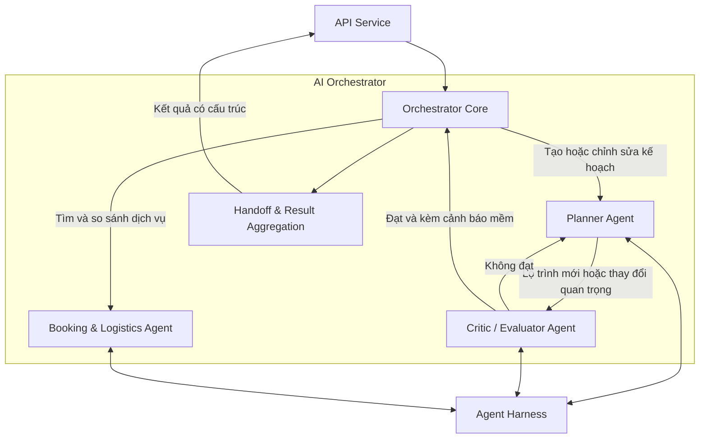
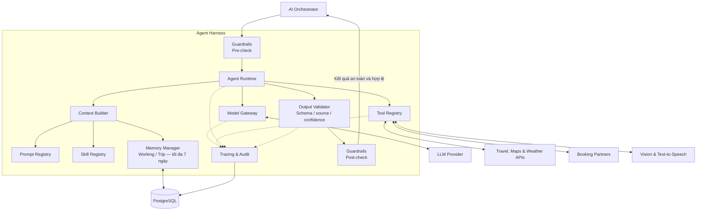
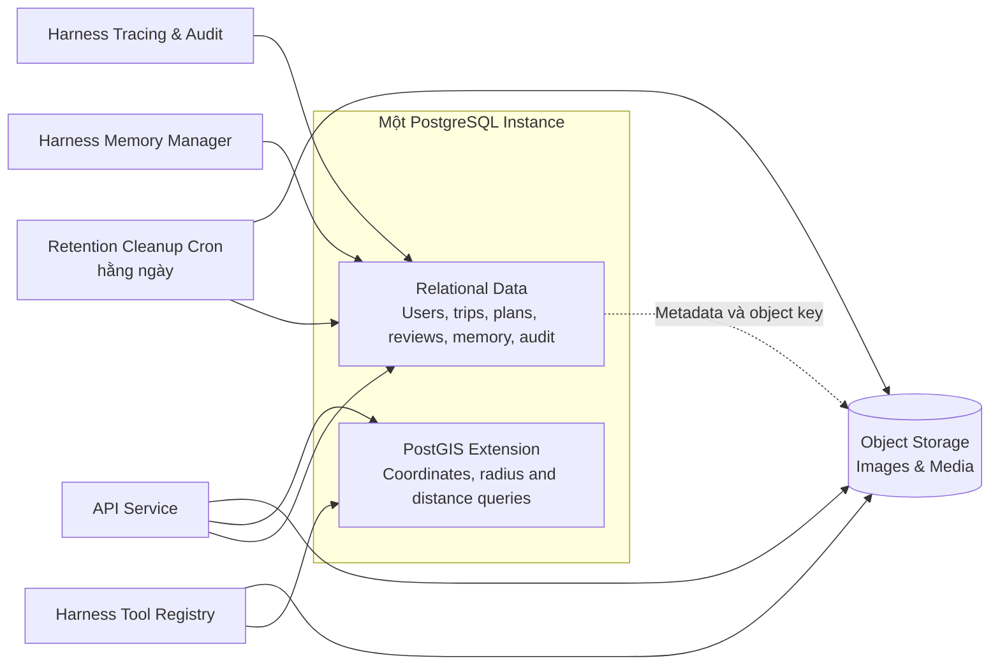

# Kiến trúc hệ thống Tour Guide Agent

Tài liệu này mô tả kiến trúc logic của Tour Guide Agent dựa trên [yêu cầu nghiệp vụ](../business-requirement.md), [user story](user-story.md) và [use case](usecase.md). Hệ thống sử dụng React cho frontend và Python/FastAPI cho backend.

Backend được triển khai dưới dạng **modular monolith**: API Service, AI Orchestrator và Agent Harness cùng nằm trong một ứng dụng và giao tiếp bằng lời gọi nội bộ. Đây là ranh giới module để phân tách trách nhiệm, không phải ba microservice độc lập.

## 1. Kiến trúc tổng quan

Kiến trúc tổng quan chỉ thể hiện các khối chính của hệ thống:

- **Frontend** cung cấp giao diện hội thoại, khám phá địa điểm, lập kế hoạch và đồng hành trong chuyến đi.
- **API Service** là biên HTTP của hệ thống, xử lý xác thực, kiểm tra đầu vào, nghiệp vụ ứng dụng và lưu trữ dữ liệu.
- **AI Orchestrator** điều phối đúng ba Agent: Planner, Critic/Evaluator và Booking & Logistics.
- **Agent Harness** cung cấp môi trường thực thi dùng chung cho Agent như context, prompt, skill, tool, memory, model và audit.
- **Data Storage** gồm một PostgreSQL có PostGIS extension và một Object Storage.

Luồng chính đi từ Frontend đến API Service. API Service xử lý các nghiệp vụ thông thường trực tiếp và chỉ chuyển các tác vụ cần AI sang Orchestrator. Orchestrator chọn Agent phù hợp, còn Harness chịu trách nhiệm chạy Agent và kiểm soát các tài nguyên mà Agent được phép sử dụng.

## 2. Các thành phần bên trong dự án

### Frontend

Frontend là ứng dụng web React + TypeScript chạy trên trình duyệt. Frontend chịu trách nhiệm trình bày dữ liệu và tiếp nhận thao tác của người dùng; các quyết định nghiệp vụ, kiểm tra tính khả thi và quyền truy cập vẫn được thực hiện ở backend.

Các nhóm giao diện chính:

- **App Shell & Session**: điều hướng, trạng thái đăng nhập và thông tin phiên làm việc.
- **Conversation & Trip Request**: hội thoại tự nhiên, nhập thông tin người đi cùng, xem và xác nhận bản tóm tắt yêu cầu.
- **Destination Discovery**: danh sách và bản đồ địa điểm, tìm theo GPS/bán kính, gửi ảnh tham chiếu và xem lý do đề xuất.
- **Itinerary Workspace**: so sánh 1–4 lộ trình, xem chi phí/cảnh báo/đánh đổi, chỉnh tay kế hoạch và chấp nhận hoặc từ chối đề xuất chỉnh sửa của Agent.
- **Booking & Logistics View**: xem và so sánh lựa chọn; người dùng được chuyển sang đối tác để tự hoàn tất giao dịch.
- **Trip Companion**: thông tin tại điểm đến, cảnh báo thay đổi, GPS chủ động theo từng chuyến và thuyết minh khi người dùng yêu cầu.
- **Review & Trip Summary**: đánh giá riêng tư/công khai, tổng kết hành trình và chi phí thực tế.
- **Source & Decision View**: hiển thị nguồn, thời điểm kiểm tra, độ tin cậy và lý do quyết định dạng tóm tắt.
- **API Client**: gọi REST API và nhận tiến trình/phản hồi Agent qua SSE.

Frontend chỉ gửi GPS khi người dùng đã bật theo dõi cho chuyến đi. Âm thanh chỉ phát sau khi người dùng xác nhận thông báo hoặc chủ động yêu cầu.

### API Service

API Service là cổng vào duy nhất của backend. Module này không chứa logic suy luận của Agent; nó quản lý giao tiếp HTTP, nghiệp vụ ứng dụng, dữ liệu bền vững và quyền truy cập.

Các thành phần bên trong:

- **FastAPI Routers**: cung cấp REST API và SSE, ánh xạ request/response và mã lỗi.
- **Authentication & Authorization**: xác thực người dùng, kiểm tra phân quyền cho 3 vai trò: User, Operator và Admin (áp dụng cơ chế Permission-based authorization).
- **Request Validation**: kiểm tra schema, định dạng tệp, kích thước dữ liệu và các trường bắt buộc như ngày đi, nơi xuất phát và ngân sách.
- **Account & Profile**: tài khoản, hồ sơ du lịch, sở thích, nhu cầu đặc biệt và quản lý trạng thái tài khoản (khóa/mở khóa bởi Admin).
- **Trip Request & Conversation**: hội thoại, bản tóm tắt yêu cầu và lịch sử trao đổi.
- **Destination & Itinerary**: địa điểm, danh mục do Admin quản trị, kiến nghị thay đổi (Maker - Checker) từ Operator, lựa chọn của người dùng, lịch trình, phiên bản kế hoạch và thao tác chỉnh sửa.
- **Booking & Trip Operations**: lựa chọn dịch vụ, theo dõi chuyến đi, cảnh báo và yêu cầu thay đổi kế hoạch.
- **Review & Trip Summary**: đánh giá, quyền riêng tư, kiểm duyệt bởi Operator/Admin và tổng kết chuyến đi.
- **Audit & Operations**: truy vấn nhật ký theo phân quyền cho Operator và Admin; bắt buộc ghi cả mục đích truy cập và Ticket ID trước khi mở chi tiết log kỹ thuật; Admin giám sát biểu đồ dòng thực thi AI.
- **Media & Location**: tiếp nhận GPS, ảnh và media; tệp nhị phân được lưu trong Object Storage.
- **Background Scheduler & Job Runner**: chạy Weather Monitor, Trip Completion và Retention Cleanup mà không cần tạo service riêng.
- **AI Orchestrator Port**: giao diện nội bộ để gửi tác vụ AI và nhận kết quả có cấu trúc.
- **Persistence Port**: đọc/ghi PostgreSQL và truy vấn không gian qua PostGIS.

API Service phải yêu cầu người dùng chấp thuận trước khi áp dụng đề xuất thay đổi của Agent hoặc cập nhật kế hoạch đã chốt. Nếu người dùng từ chối thì kế hoạch hiện tại được giữ nguyên. API Service không tự đặt dịch vụ, giữ tiền hoặc thanh toán thay người dùng.

#### Cơ chế chạy nền

Background Scheduler chạy trong cùng ứng dụng backend và điều phối ba job:

- **Weather Monitor Job** chạy theo chu kỳ cấu hình, chỉ quét chuyến đi đang hoạt động, lấy dữ liệu thời tiết/thời gian di chuyển/giờ mở cửa và tạo cảnh báo khi có thay đổi đáng kể. Job chỉ yêu cầu Planner tạo phương án thay thế khi cần và không tự cập nhật kế hoạch đã chốt.
- **Trip Completion Job** chạy theo chu kỳ cấu hình, tìm chuyến đi đã đến thời điểm kết thúc hoặc nhận tín hiệu kết thúc sớm, sau đó tạo đúng một bản nháp tổng kết.
- **Retention Cleanup Cron** chạy hằng ngày, đánh dấu hết hạn rồi dọn dữ liệu GPS, tệp media gốc, working/trip memory và log kỹ thuật chi tiết đã quá 7 ngày.

Mỗi job phải có tính idempotent. Khi backend chạy nhiều worker hoặc instance, scheduler dùng khóa điều phối trong PostgreSQL để bảo đảm chỉ một worker thực thi một lượt job; vì vậy kiến trúc hiện tại chưa cần message broker riêng.

### AI Orchestrator

AI Orchestrator nhận tác vụ từ API Service, chọn Agent phù hợp, quản lý việc bàn giao và bảo đảm các Agent cùng sử dụng một bản tóm tắt yêu cầu, dữ liệu đã kiểm chứng và phiên bản kế hoạch hiện tại.

Hệ thống chỉ có ba Agent:

- **Planner Agent** phân tích yêu cầu đã xác nhận để tạo từ 1–4 lộ trình và điều chỉnh lộ trình khi người dùng hoặc Critic yêu cầu. Kết quả gồm lịch từng ngày, phương tiện, chi phí, hành lý, điểm nổi bật và đánh đổi.
- **Critic/Evaluator Agent** là bước kiểm tra bắt buộc đối với lộ trình mới và thay đổi quan trọng. Agent kiểm tra ngân sách, giờ mở cửa, thời gian di chuyển và rủi ro an toàn; phương án không khả thi bị trả lại Planner, còn cảnh báo mềm được giữ lại để người dùng cân nhắc.
- **Booking & Logistics Agent** tìm và so sánh khách sạn, chuyến bay, phương tiện hoặc dịch vụ từ đối tác. Agent chỉ chuẩn bị lựa chọn và hướng dẫn chuyển hướng; không được tự đặt chỗ, giữ tiền hoặc thanh toán.

Orchestrator không tự thực hiện chức năng của Agent và không tạo thêm Agent động. Các khả năng như tìm kiếm địa điểm, đọc thời tiết, nhận diện ảnh hoặc tạo thuyết minh được cung cấp dưới dạng skill và tool trong Harness. Kết quả chỉnh sửa của Agent được trả về API dưới dạng đề xuất; chỉ sau khi người dùng chấp nhận thì API mới ghi phiên bản kế hoạch mới.

### Agent Harness

Agent Harness là lớp runtime dùng chung để chạy ba Agent một cách nhất quán và có kiểm soát. Harness không phải Agent thứ tư và không phải service triển khai độc lập.

Các thành phần của Harness:

- **Agent Runtime** quản lý vòng đời một lần chạy Agent, timeout, retry có giới hạn, hủy tác vụ và trả kết quả về Orchestrator.
- **Context Builder** tạo context tối thiểu cần thiết từ yêu cầu đã xác nhận, hồ sơ liên quan, dữ liệu đã kiểm chứng và phiên bản kế hoạch hiện tại.
- **Prompt Registry** quản lý system prompt, prompt template, output schema và phiên bản cấu hình của từng Agent.
- **Skill Registry** quản lý các kỹ năng tái sử dụng như phân tích yêu cầu, tìm địa điểm, lập lịch, kiểm tra tính khả thi, so sánh dịch vụ và thuyết minh. Skill là khả năng của Agent, không phải Agent con.
- **Tool Registry** đăng ký tool với schema rõ ràng, giới hạn tool theo từng Agent, kiểm tra tham số và thực thi lời gọi tới nguồn dữ liệu hoặc API đối tác.
- **Memory Manager** quản lý working memory của lần chạy và trip memory với thời hạn tối đa 7 ngày. Thuộc tính cá nhân hóa đã được người dùng xác nhận được trích xuất vào hồ sơ du lịch, không tiếp tục tồn tại dưới dạng Agent memory tạm thời.
- **Model Gateway** là điểm gọi mô hình tập trung, áp dụng timeout, retry, giới hạn token và yêu cầu structured output.
- **Guardrails** thực thi giới hạn quyền hạn, quyền riêng tư, sự đồng ý sử dụng GPS và nguyên tắc không tự thực hiện giao dịch.
- **Output Validator** kiểm tra schema và quy tắc nghiệp vụ; thông tin biến động phải có nguồn, thời điểm kiểm tra và mức độ tin cậy.
- **Tracing & Audit** ghi đầu vào, phản hồi, nguồn, tool đã gọi, kết quả, lỗi, phiên bản Agent và lý do tóm tắt có cấu trúc trong tối đa 7 ngày. Harness không lưu hoặc hiển thị chuỗi suy luận thô của mô hình.

### Data Storage

Hệ thống chỉ sử dụng hai dịch vụ lưu trữ vật lý. PostGIS là extension chạy trong cùng PostgreSQL, không phải database hoặc service thứ ba.

#### PostgreSQL với PostGIS

PostgreSQL là nguồn dữ liệu có cấu trúc duy nhất, lưu:

- tài khoản (User, Operator, Admin), hồ sơ du lịch, phân quyền và trạng thái khóa tài khoản;
- hội thoại, yêu cầu chuyến đi và bản tóm tắt đã xác nhận;
- địa điểm, danh mục, nội dung thuyết minh, kiến nghị thay đổi (Maker - Checker) và cấu hình hệ thống;
- lịch trình, phiên bản kế hoạch, kết quả thẩm định Critic và lựa chọn dịch vụ;
- đánh giá, báo cáo vi phạm, kiểm duyệt, tổng kết và chi phí thực tế;
- working/trip memory của Agent trong tối đa 7 ngày;
- nguồn dữ liệu, độ tin cậy, tool call, lỗi, nhật ký truy cập an ninh và audit log kỹ thuật trong tối đa 7 ngày.

PostGIS mở rộng PostgreSQL để lưu tọa độ và thực hiện truy vấn không gian như tìm địa điểm trong bán kính, tính khoảng cách và đối chiếu vị trí GPS. Dữ liệu GPS chỉ được xử lý theo trạng thái đồng ý của người dùng.

#### Object Storage

Object Storage lưu ảnh và tệp đa phương tiện của hội thoại, ảnh tham chiếu, ảnh đánh giá và ảnh tổng kết chuyến đi trong tối đa 7 ngày. PostgreSQL chỉ lưu metadata, quyền sở hữu, trạng thái riêng tư, thời điểm hết hạn và object key; không lưu trực tiếp nội dung nhị phân lớn.

Mỗi bản ghi thuộc phạm vi retention có trường thời điểm hết hạn. Retention Cleanup cron chạy hằng ngày: trước tiên đánh dấu dữ liệu quá hạn để ngăn truy cập, sau đó xóa hoặc ẩn danh dữ liệu trong PostgreSQL và xóa object tương ứng trong Object Storage. Hồ sơ, kế hoạch, đánh giá, bản tổng kết và dữ liệu có cấu trúc đã được người dùng xác nhận tiếp tục được lưu trong lịch sử tài khoản.

Kiến trúc hiện tại chưa yêu cầu database vector, cache phân tán hoặc message broker riêng. Chỉ bổ sung các thành phần đó khi có nhu cầu đã được đo lường như tìm kiếm vector quy mô lớn, tải đọc cao hoặc tác vụ nền cần retry bền vững trên nhiều tiến trình.
