# Sơ đồ use case — Tour Guide Agent

Tài liệu mô tả các chức năng của hệ thống hỗ trợ khách du lịch tự túc tại Việt Nam, từ chuẩn bị đến tổng kết chuyến đi. Một tài khoản có thể lập kế hoạch cho nhiều người; không bao gồm cộng tác nhiều tài khoản, quản trị đoàn hoặc điều hành tour.

**Tài liệu tham chiếu:** [Yêu cầu nghiệp vụ](../business-requirement.md) và [User story](user-story.md).

**Cách đọc sơ đồ:** Mermaid được biểu diễn bằng `flowchart` với các nút bo tròn mô phỏng use case; khung bao quanh là phạm vi hệ thống. Nút bên ngoài là tác nhân; đường liền thể hiện tác nhân tham gia chức năng, không biểu diễn thứ tự thao tác. Mũi tên `«include»` đi từ chức năng chính đến chức năng bắt buộc dùng chung; `«extend»` đi từ chức năng bổ sung đến chức năng chính, chỉ xảy ra khi điều kiện ghi trên đường nối được đáp ứng. Planner, Critic/Evaluator và Booking & Logistics là thành phần nội bộ, không phải tác nhân bên ngoài.

## 1. Tài khoản và hồ sơ du lịch

**Mô tả:** Người dùng quản lý tài khoản, sở thích, nhu cầu đặc biệt và ngân sách thường dùng, đồng thời xem lại hội thoại và chuyến đi. Hồ sơ và dữ liệu chuyến đi đã xác nhận được dùng để cá nhân hóa đề xuất.

**Đối chiếu:** Mục “Tài khoản và cá nhân hóa” trong yêu cầu nghiệp vụ; US02, US62, US64. Đăng ký và đăng nhập được quản lý trực tiếp từ yêu cầu nghiệp vụ, không tách thành user story riêng trong phạm vi hiện tại.

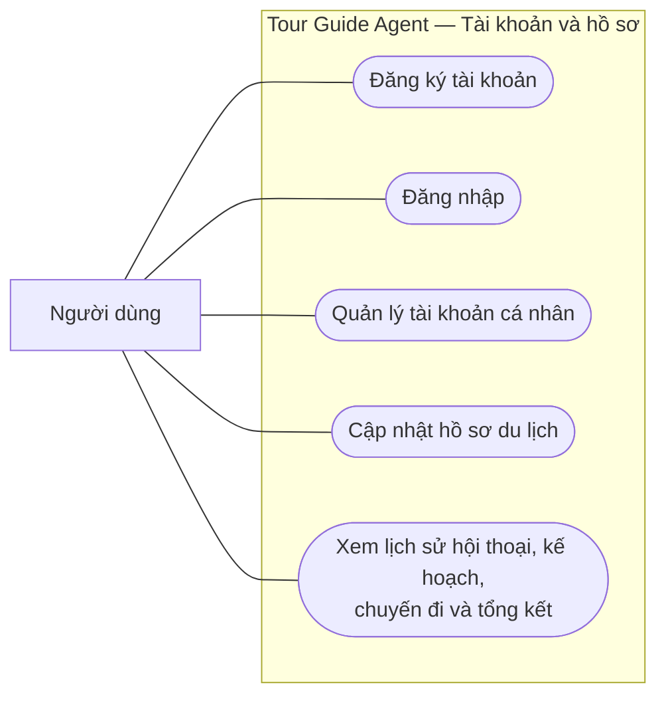

## 2. Tiếp nhận và xác nhận yêu cầu chuyến đi

**Mô tả:** Người dùng mô tả chuyến đi bằng hội thoại, bổ sung thông tin người đi cùng và ngữ cảnh từ GPS hoặc media. Hệ thống hỏi lại thông tin thiếu hoặc chưa rõ; ngày đi, nơi xuất phát và ngân sách phải đầy đủ trước khi lập kế hoạch từ bản tóm tắt đã xác nhận.

**Đối chiếu:** US01–US08.

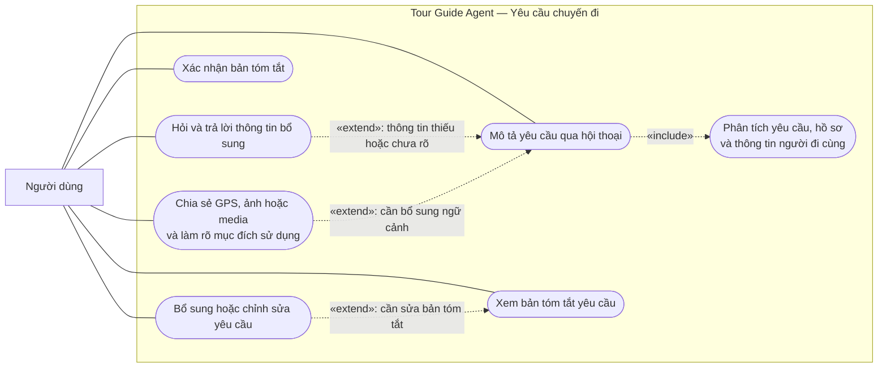

## 3. Tìm kiếm và lựa chọn địa điểm du lịch

**Mô tả:** Hệ thống gợi ý địa điểm tại Việt Nam theo nhu cầu chuyến đi, hỗ trợ tìm theo bán kính hoặc ảnh tương đồng. Người dùng xem xếp hạng, lý do đề xuất và thông tin kiểm chứng, rồi chọn hoặc bỏ chọn địa điểm để cập nhật yêu cầu.

**Đối chiếu:** US09–US15, US51.

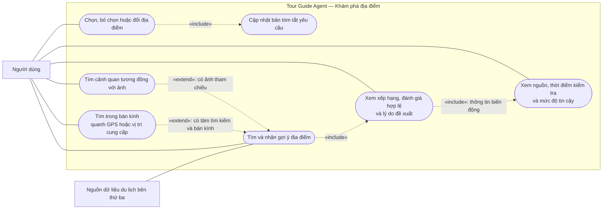

## 4. Lập lịch trình và so sánh phương án

**Mô tả:** Từ yêu cầu đã xác nhận, hệ thống tạo 1–4 lộ trình gồm lịch từng ngày, nơi lưu trú, hoạt động, phương tiện, dự trù chi phí và hành lý. Mọi lộ trình phải được kiểm tra ngân sách, giờ mở cửa, thời gian di chuyển và an toàn; phương án không khả thi bị chặn và điều chỉnh trước khi hiển thị.

**Đối chiếu:** US16–US22; thống nhất giới hạn từ 1 đến 4 lộ trình.

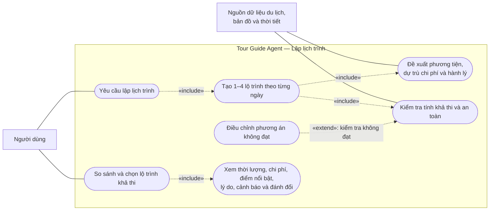

## 5. Tùy chỉnh và lưu kế hoạch

**Mô tả:** Người dùng có thể chỉnh tay hoặc yêu cầu Agent sửa đúng phần được chỉ định, gồm địa điểm, nơi lưu trú, chặng di chuyển, hoạt động và vật dụng. Với thay đổi do Agent đề xuất, hệ thống hiển thị phần bị ảnh hưởng, lý do và cảnh báo nhưng chưa áp dụng ngay. Người dùng phải xác nhận chấp nhận hoặc từ chối; khi từ chối, kế hoạch hiện tại được giữ nguyên.

**Đối chiếu:** US23–US28.

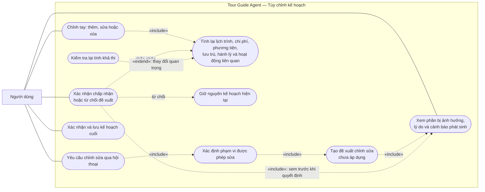

## 6. Tìm dịch vụ và hướng dẫn đặt chỗ với đối tác

**Mô tả:** Hệ thống tìm và so sánh khách sạn, chuyến bay, phương tiện và dịch vụ qua API đối tác, chuẩn bị thông tin cần thiết và hiển thị giá cuối cùng cùng điều kiện hủy/đổi. Người dùng tự xác nhận và thanh toán trên trang đối tác; hệ thống không tự đặt chỗ, giữ tiền hoặc thanh toán thay.

**Đối chiếu:** US29–US34.

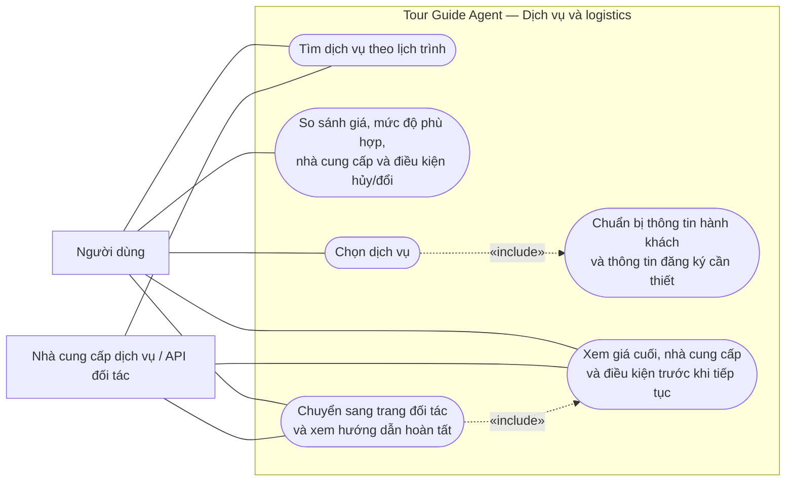

Việc xác nhận giao dịch và thanh toán nằm ngoài phạm vi Tour Guide Agent, trên hệ thống của nhà cung cấp.

## 7. Khám phá và thuyết minh trong chuyến đi

**Mô tả:** Người dùng hỏi thông tin, gửi ảnh để nhận diện địa điểm và nhận gợi ý hoạt động; khi nhận diện chưa chắc chắn, hệ thống đưa ra các khả năng và hỏi lại. Gợi ý thuyết minh khi đến gần điểm trong lịch trình chỉ sử dụng GPS đã bật; âm thanh chỉ phát khi người dùng xác nhận hoặc chủ động yêu cầu.

**Đối chiếu:** US35–US41.

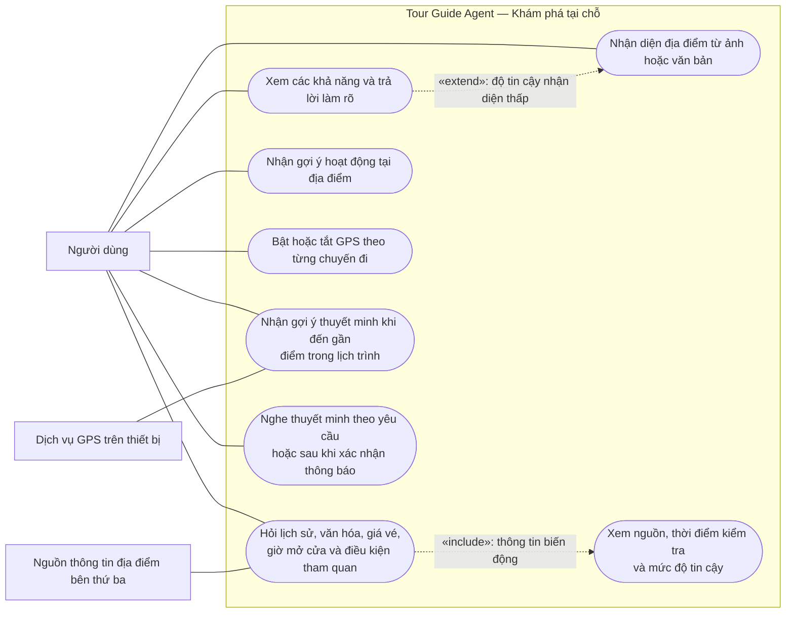

## 8. Theo dõi và ứng phó thay đổi thời gian thực

**Mô tả:** Background Weather Monitor định kỳ quét các chuyến đi đang hoạt động, lấy thời tiết, thời gian di chuyển và giờ mở cửa mới nhất để phát hiện ảnh hưởng đến kế hoạch. Khi có thay đổi đáng kể, hệ thống cảnh báo, đánh dấu điểm không thể ghé và có thể yêu cầu Agent tạo phương án thay thế. Kế hoạch đã chốt chỉ được cập nhật sau khi người dùng xem và chấp thuận thay đổi.

**Đối chiếu:** US42–US45; áp dụng kiểm chứng và tính lại kế hoạch tại US26–US27.

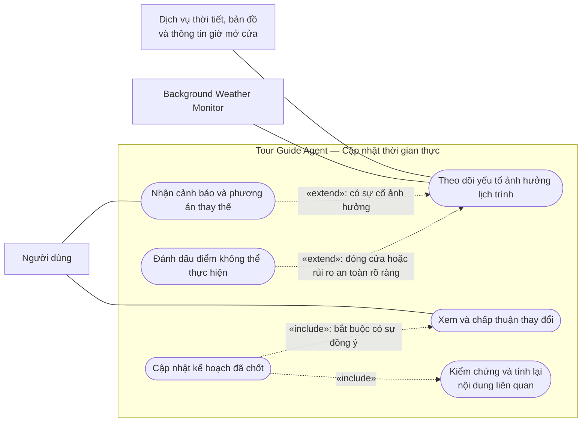

## 9. Đánh giá, quyền riêng tư và kiểm duyệt

**Mô tả:** Người dùng chấm điểm, viết nhận xét và quản lý trạng thái riêng tư/công khai của từng bài; bài mới mặc định riêng tư. Bài yêu cầu công khai phải được kiểm duyệt, chống spam và xác minh tính liên quan, chuyến đi hợp lệ trước khi hiển thị; chỉ bài công khai hợp lệ được dùng để xếp hạng.

**Đối chiếu:** US46–US51, US59–US60.

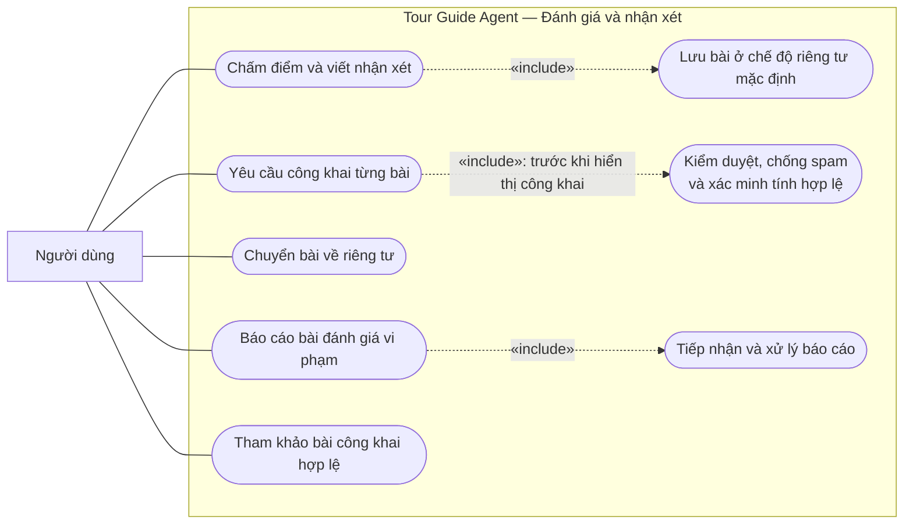

## 10. Tổng kết hành trình và chi phí thực tế

**Mô tả:** Background Trip Completion job định kỳ quét các chuyến đi đã đến thời điểm kết thúc; tín hiệu kết thúc sớm cũng kích hoạt cùng luồng xử lý. Job có tính idempotent để chỉ tạo một bản nháp tổng kết cho mỗi lần kết thúc chuyến đi. Bản nháp phân loại điểm đã đi, bỏ qua và phát sinh từ dữ liệu tương tác, xác nhận và GPS nếu đã bật. Người dùng sửa lại hành trình, lưu cảm nhận và ảnh; nhập chi phí là tùy chọn, chỉ so sánh khi có số liệu thực tế.

**Đối chiếu:** US52–US59, US61. Việc công khai đánh giá địa điểm được mô tả ở mục 9.

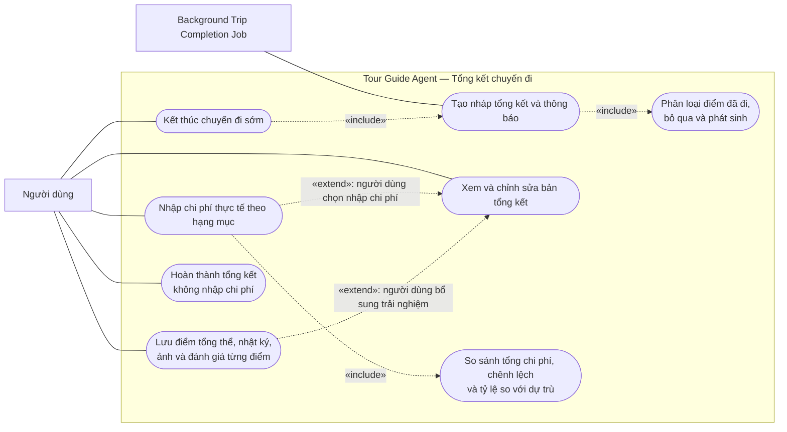

Không suy diễn chi phí chưa nhập thành số tiền bằng không. Nhận xét cho từng địa điểm vẫn mặc định riêng tư.

## 11. Xác nhận tổng kết và gợi ý chuyến đi tiếp theo

**Mô tả:** Khi xác nhận tổng kết, người dùng chốt dữ liệu vào lịch sử và đồng ý dùng dữ liệu đó để cập nhật sở thích, thói quen chi tiêu và nhịp độ di chuyển. Hệ thống đưa ra 1–3 ý tưởng chuyến đi tiếp theo; người dùng có thể mở hội thoại lập kế hoạch mới từ thẻ gợi ý với sở thích điền sẵn.

**Đối chiếu:** US62–US64.

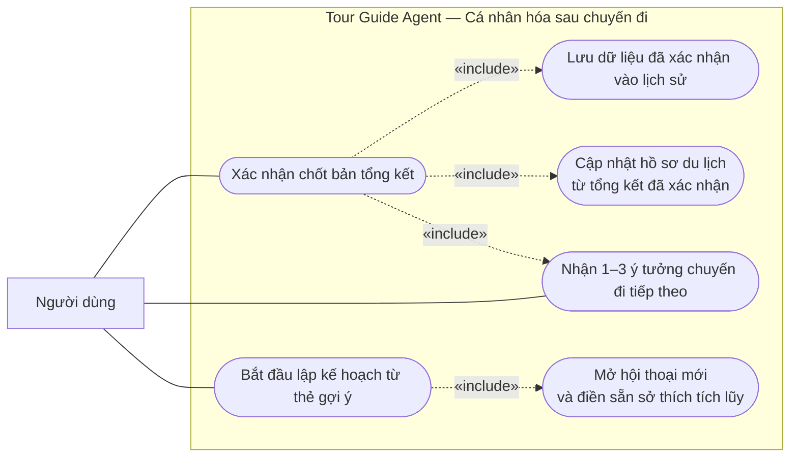

## 12. Minh bạch thông tin và quyết định của Agent

**Mô tả:** Người dùng xem căn cứ của đề xuất hoặc thay đổi, nguồn dữ liệu, thời điểm kiểm tra, mức độ tin cậy, cảnh báo và đánh đổi. Hệ thống lưu nhật ký gồm đầu vào, phản hồi, nguồn, công cụ và kết quả, lỗi, phiên bản Agent cùng lý do tóm tắt có cấu trúc; không lưu hoặc hiển thị chuỗi suy luận thô.

**Đối chiếu:** US65–US67, SYS70; dùng chung cho khám phá, lập lịch trình và cập nhật kế hoạch.

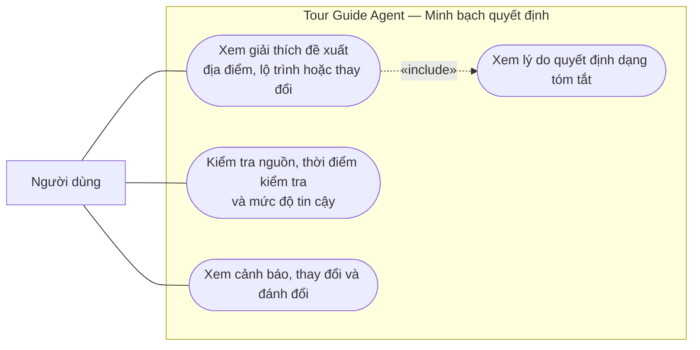

## 13. Tra cứu nhật ký kỹ thuật và truy vết lỗi

**Mô tả:** Nhân viên vận hành (Operator) hoặc Quản trị viên (Admin) được cấp quyền tra cứu nhật ký, lọc theo mã chuyến đi, Agent, mã lỗi hoặc thời gian; Admin có quyền xem dòng thực thi chi tiết và sự bàn giao giữa các Agent để truy vết lỗi. Trước khi mở chi tiết log của người dùng, bắt buộc phải khai báo cả mục đích truy cập và Ticket ID; mỗi lần truy cập được ghi nhận danh tính, thời gian, IP, mục đích và Ticket ID vào nhật ký an ninh.

**Đối chiếu:** US68–US70. Áp dụng yêu cầu khai báo cả mục đích và Ticket ID của US69; dữ liệu chỉ dùng để cung cấp, hỗ trợ và bảo vệ dịch vụ.

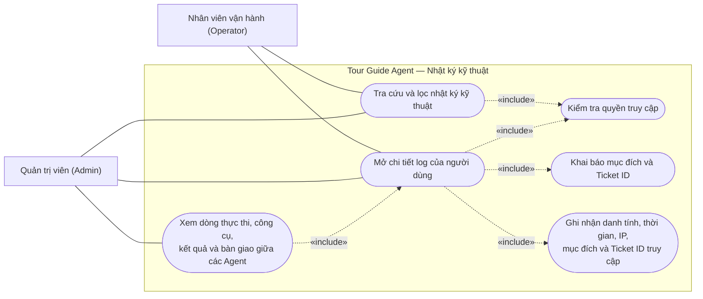

## 14. Hết hạn và dọn dẹp dữ liệu tạm thời

**Mô tả:** Dữ liệu GPS, tệp media gốc, working/trip memory của Agent và log kỹ thuật chi tiết được lưu tối đa 7 ngày. Một Retention Cleanup cron job chạy hằng ngày, dùng mốc hết hạn để đánh dấu dữ liệu không còn khả dụng rồi xóa bản ghi hoặc object quá hạn. Hồ sơ, kế hoạch, đánh giá, bản tổng kết và dữ liệu có cấu trúc đã được người dùng xác nhận không thuộc nhóm dữ liệu tạm thời này.

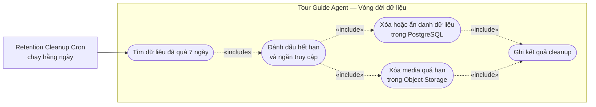

## 15. Quản trị kho dữ liệu và Phê duyệt kiến nghị (Maker – Checker)

**Mô tả:** Nhân viên vận hành (Operator) gửi các kiến nghị thay đổi (cập nhật thông tin địa điểm, báo cáo sự cố khẩn cấp hoặc phản ánh logic AI) lên hệ thống. Quản trị viên (Admin) là người có thẩm quyền duy nhất xem xét, phê duyệt hoặc từ chối kiến nghị; khi phê duyệt, dữ liệu tự động cập nhật vào kho địa điểm. Ngoài ra, Admin toàn quyền thêm mới, chỉnh sửa, xóa địa điểm, quản trị tài khoản người dùng và cấu hình tham số hệ thống.

**Đối chiếu:** US71–US75.

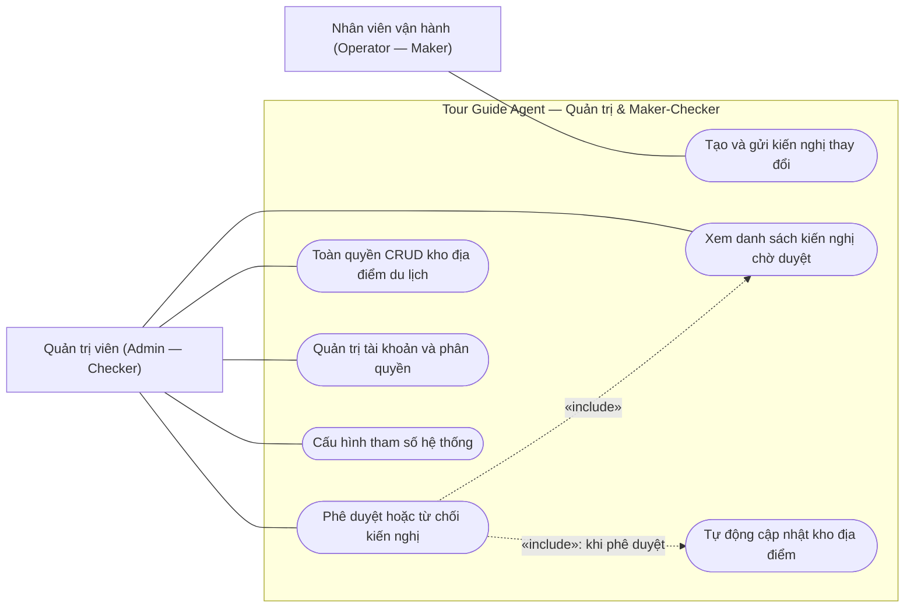
